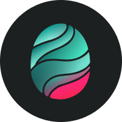

# Sea Glass Theme for Obsidian

---
### About:
After switching to Obsidian for my note taking, I wanted to implement a custom theme I made for VSCode to keep my workflow looking consistent.

The goal of this theme was to create something that was easy on the eyes and had a bit of color inspired by the beach. I hope you enjoy it!

---
### Sea Glass Theme for VSCode:
As mentioned above, I have a VSCode theme that is very similar to this one. If you enjoy this theme for Obsidian, I would greatly appreciate if you checked it out for VSCode too!

You can find it [Here.](https://marketplace.visualstudio.com/items?itemName=KyleStewart.sea-glass-color-theme)

---
### Features:
- This theme is soley for dark mode and does not support light mode at all.
- The [Euclid Circular A](https://www.cufonfonts.com/font/euclid-circular-a) font is built in to the theme and is used for the UI and editor. If you do not have this font installed, the theme should fall back to the default font. I highly recommend installing this font for the best experience.
- For code blocks, [CaskaydiaCove Nerd Font Mono](https://github.com/eliheuer/caskaydia-cove) is used. This font is also built in to the theme and should fall back to the default font if you do not have it installed. Additionally, the syntax highlighting for code blocks is based on the Sea Glass theme for VSCode. If you would like to use this theme for VSCode, you can find it [Here.](https://marketplace.visualstudio.com/items?itemName=KyleStewart.sea-glass-color-theme)

---
### Screenshots:

---
### Future Plans:
I have no major plans for this theme at the moment. I will be using it for my own notes and will make changes as I see fit. If you have any suggestions, feel free to open an issue or pull request.

---
Hope you enjoy!